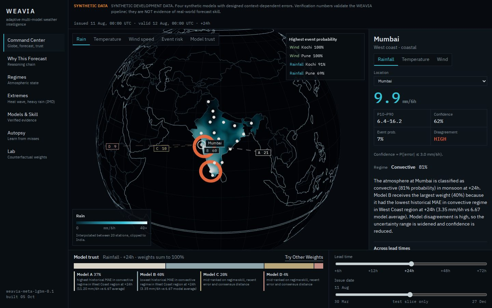
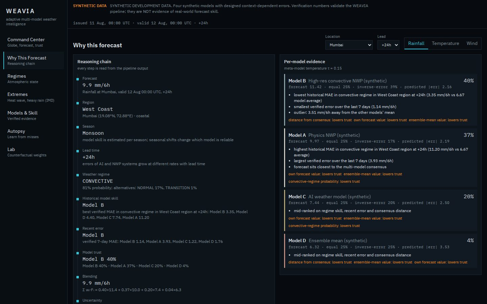
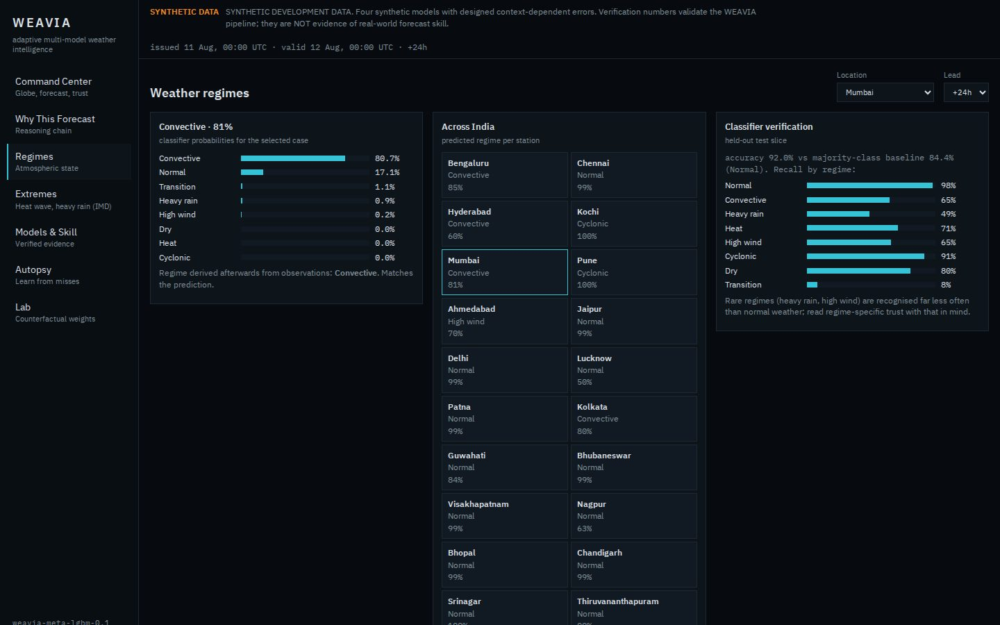
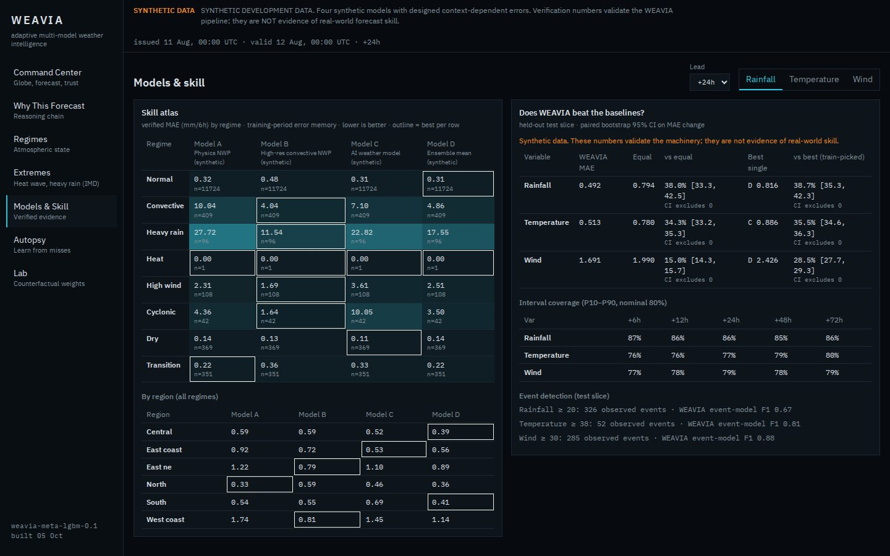

<div align="center">

# 🌦️ WEAVIA

### Hybrid AI–NWP multi-model forecast blending for disaster management

*Adaptive. Explainable. Verified against observations.*


-E0A030?labelColor=555555&style=flat-square)


[🚀 Live demo](https://weavia-adaptive-multi-model-weather.vercel.app) ·
[🎥 Intro Video](#-intro-video) ·
[📄 PRD](docs/PRD.md) ·
[🧩 Architecture](docs/ARCHITECTURE.md) ·
[🛠️ Tech Stack](#11-technology) ·
[📊 Results](#6-verification-and-results) ·
[✅ Verification](docs/VERIFICATION.md) ·
[🔗 API](docs/API.md) ·
[🗺️ Roadmap](#9-roadmap-to-sih-2026-demo)

</div>

> **Weather models do not have to agree. The system has to know when to trust each one.**

**Smart India Hackathon 2026 · SIH26081 · Ministry of Earth Sciences (MoES) · Software · Disaster Management**

---

## 🧭 For judges: 60-second path

**What it is.** WEAVIA learns which weather model to trust, for each station, lead time, season and weather regime. It blends them with those weights, attaches uncertainty and IMD-aligned extreme-weather guidance, and then checks itself against what actually happened. Built for SIH26081 (MoES).

**Live demo:** [weavia-adaptive-multi-model-weather.vercel.app](https://weavia-adaptive-multi-model-weather.vercel.app). It serves the synthetic benchmark (60 monsoon issues) and says so on every screen. It runs on free hosting that sleeps when idle, so **the first load can take about a minute**.

**Read, no setup needed**

| # | Open | You will see |
|---|---|---|
| 1 | [PS alignment matrix](docs/PS_ALIGNMENT.md) | Every PS outcome, the feature behind it, the evidence, and the gaps |
| 2 | [Verification](docs/VERIFICATION.md) | The test protocol, confidence intervals, and what is still wrong |
| 3 | [Architecture](docs/ARCHITECTURE.md) | Pipeline, modules, provider contract |
| 4 | [`backend/tests`](backend/tests) | 119 automated tests, including leakage checks that fail when a leak is injected |
| 5 | [Hosting the demo](docs/DEPLOY.md) | Free-tier hosting of the demo snapshot (Render + Vercel), cold-start note, what is verified |
| [Real-data plan](docs/REAL_DATA_PLAN.md) | How it moves to real Open-Meteo data and runs every 6 hours |

**What is proven, and what is not**

| Claim | Status |
|---|---|
| The blending, trust, uncertainty, event and verification machinery works end to end | **Proven.** Tests and a synthetic benchmark |
| WEAVIA beats individual models | **Proven on synthetic data only.** Not yet measured on real weather |
| Real-data and 6-hourly operation, IMD-aligned heat-wave and rain products | **Built and tested offline.** Not yet run against the real service |
| Heat-wave output | An **indicator**. Only IMD declares heat waves |

Every screen carries a banner naming its data source. Where a confidence interval includes zero, the dashboard says "no claim" instead of reporting a win.

<table>
<tr>
<td width="50%"><br/><sub><b>Command center.</b> Rain field, model trust weights, uncertainty.</sub></td>
<td width="50%"><br/><sub><b>Why this forecast.</b> The reasoning behind each weight.</sub></td>
</tr>
<tr>
<td width="50%"><br/><sub><b>Regimes.</b> Detected weather regime per station.</sub></td>
<td width="50%"><br/><sub><b>Models and skill.</b> Verified evidence with confidence intervals.</sub></td>
</tr>
</table>

*Screenshots are from the synthetic development dataset (see the banner in each image), not real forecasts.*

**Fastest way to run it** (Windows, uses the committed 24 MB demo snapshot, no 4-minute pipeline): `scripts\\run_demo.bat`. It starts the API and the dashboard at http://localhost:3000. Same synthetic data, last 60 issues only.

**Run the full pipeline yourself** (about 4 minutes, Python 3.12 and Node 18+):

```bash
cd backend
pip install -r requirements.txt
python -u -W ignore -c "from weavia.pipeline import run; run('data', days=1095)"
uvicorn weavia.api.main:app --port 8000
# second terminal
cd weavia-frontend && npm install && npm run dev      # http://localhost:3000
```

---

## 🎥 Intro Video

*A short walkthrough of the problem statement and our solution.*

<!-- Replace with your video. YouTube: [](https://www.youtube.com/watch?v=VIDEO_ID) -->
▶️ *Video coming soon.*

---

## At a glance

| | |
|---|---|
| **Event** | Smart India Hackathon 2026 |
| **Problem Statement** | SIH26081, Hybrid AI–NWP Multi-Model Forecast Blending System |
| **Organization** | Ministry of Earth Sciences (MoES) |
| **Category / Theme** | Software / Disaster Management |
| **Project** | WEAVIA, Adaptive Multi-Model Weather Intelligence |
| **Status** | Working end-to-end prototype on **synthetic data**. Real-data integration in progress. See [Project status](#4-project-status) |

> ⚠️ **Honesty notice.** All verification numbers in this repository come from a **synthetic** multi-model world. They prove the machinery works. They are **not** evidence of skill against real weather models. The UI shows a synthetic-data banner at all times. No accuracy claim is made until it is measured on real data.

---

## Documentation

| Document | What it covers |
|---|---|
| [PRD](docs/PRD.md) | Problem, goals, scope, requirements, metrics, risks |
| [Architecture](docs/ARCHITECTURE.md) | Pipeline stages, modules, provider contract, artifacts |
| [Verification](docs/VERIFICATION.md) | Test protocol, baselines, bootstrap method, results, known gaps |
| [API reference](docs/API.md) | All 16 routes, parameters, errors, examples |
| [SIH26081 alignment](docs/PS_ALIGNMENT.md) | PS outcome to feature to evidence matrix, gaps and priority plan |
| [Real-data plan](docs/REAL_DATA_PLAN.md) | Sources, history limits, ground truth, live-cycle design |
| [Data, privacy and use](docs/PRIVACY_AND_USE.md) | What is collected (nothing), intended use, licence |
| [Security policy](SECURITY.md) | Reporting, built-in protections, known limits |
| [Frontend work log](docs/FRONTEND_WORK.md) | Frontend build notes |

---

## 1. The problem

No single forecast model is best everywhere, for every variable, at every lead time.

- A physical **NWP** model can win in one region or situation.
- An **ensemble** gives better uncertainty information.
- An **AI/ML weather model** can win for particular variables, lead times, or regimes.

So "which model is best?" is the wrong question. The useful one is:

> **Which forecast source should we trust most for this location, variable, lead time, season and weather regime, and why?**

WEAVIA is built around that question. It scores each source in context, learns from verified history, assigns adaptive weights, blends, attaches uncertainty and extreme-event signals, and then **verifies itself against observations** so the next forecast is better informed.

A simple average treats every source as equally trustworthy:

```text
Model A → 20 mm
Model B → 40 mm        Equal average = 40 mm
Model C → 60 mm
```

WEAVIA weights by context and measured skill:

```text
Model A → 20 mm × 0.20
Model B → 40 mm × 0.50
Model C → 60 mm × 0.30
                         ─────
Blended forecast       = 42 mm
```

The weights are **not hard-coded**. They are learned from historical error, regime and context.

---

## 2. SIH 2026 alignment (SIH26081)

The problem statement lists five expected outcomes. This is how WEAVIA addresses each one, and where it stands today.

| SIH26081 expected outcome | WEAVIA response | Status |
|---|---|---|
| Dynamically blended forecast | Context-aware adaptive blending of multiple sources (rain, temperature, wind) | 🟢 Implemented (synthetic sources) |
| Model weight maps | Globe/map of dominant-model trust and per-model weights, served from `/map` and `/trust` | 🟢 Implemented |
| Improved forecast skill vs individual models | Baseline-vs-adaptive verification with bootstrap confidence intervals | 🟢 Machinery implemented, 🟡 real-data proof pending |
| Extreme-weather guidance (heavy rain, heat wave, high wind) | Event models with uncertainty and false-alarm/miss reporting | 🟢 Rain, temperature and wind event models fitted and verified (point estimates, no event CIs yet) |
| Operational workflow / dashboard | One-command pipeline + FastAPI service + Next.js command center | 🟢 Implemented |

Additional SIH requirements, region-aware, season-aware, lead-time-aware, and regime-aware weighting, are handled by the Trust and Regime engines (Section 5).

---

## 3. How it works

```text
        MULTIPLE FORECAST SOURCES
                    │
                    ▼
          FORECAST HARMONIZATION
                    │
                    ▼
             CONTEXT ENGINE
       ┌────────────┼────────────┐
     Region       Season      Lead time
       └────────────┼────────────┘
                    ▼
          WEATHER REGIME DETECTION
                    │
                    ▼
            MODEL TRUST ENGINE  ◄────── SKILL MEMORY
                    │                        ▲
                    ▼                        │
           ADAPTIVE WEIGHTING                │
                    │                        │
                    ▼                        │
             BLENDED FORECAST                │
          ┌─────────┴─────────┐              │
     UNCERTAINTY        EXTREME-EVENT        │
       SIGNALS             SIGNALS           │
          └─────────┬─────────┘              │
                    ▼                        │
              VERIFICATION ──────────────────┘
```

> **Blending is the mechanism. Learning which forecast to trust is the intelligence.**

### Adaptive blending

For sources $F_1 \dots F_n$ with normalized weights:

$$
\sum_{i=1}^{n} w_i = 1, \qquad F_{WEAVIA} = \sum_{i=1}^{n} w_i F_i
$$

Weights depend on context:

$$
w_i = f(\text{region},\ \text{lead time},\ \text{season},\ \text{variable},\ \text{regime},\ \text{historical skill},\ \text{recent error},\ \text{model disagreement})
$$

The exact functional form may evolve. The design requirement does not: weights stay **adaptive, measurable and explainable**.

---

## 4. Project status

Legend: 🟢 Implemented · 🟡 In progress · 🔵 Planned · ⚪ Mock / synthetic

### Backend (Python 3.12, FastAPI)

| Component | Status | Notes |
|---|---|---|
| Config, locations (20 India stations), regime labels | 🟢 | |
| Synthetic multi-model world | ⚪ | Behind the same provider interface real sources will use |
| Provider interface + synthetic providers | 🟢 | |
| Harmonization (time, units, variables, QC) | 🟢 | |
| Feature builder | 🟢 | |
| Regime detection | 🟢 | |
| Trust engine (skill × context, recent error) | 🟢 | |
| Blending (equal, inverse-error, adaptive) | 🟢 | |
| Uncertainty (spread, intervals, confidence) | 🟡 | Rain intervals now have real width. Wet-case coverage still 74–76% vs 80% nominal, see [Known limitations](#8-known-limitations) |
| Extreme-event models | 🟢 | Rain, temperature, wind. Time-blocked cross-fit on train + validation |
| Verification (bootstrap CIs vs baselines) | 🟢 | |
| Explain, Autopsy, Lab modules | 🟢 | |
| Parquet store + pipeline | 🟢 | ~135 s for a 3-year synthetic run |
| FastAPI service (16 routes under `/api/v1`) | 🟢 | Pydantic models, 422/404 validation, CORS, per-client rate limiting, security headers |
| Test suite | 🟢 | 119 tests: IMD rules, daily extremes, API, leakage, harmonize, bootstrap, rain calibration, event model, rate limiter, Open-Meteo provider, full real-data chain |
| Real-data providers (Open-Meteo: live, Previous Runs, archive truth) | 🟡 | Built and tested against a fake of the documented API. **Not yet run against the real service**: run `python -m weavia.live check` first |
| IMD-aligned extremes (heat-wave indicator, 24 h rain classes, daily maximum) | 🟡 | Real-data mode only. Rules, calibration, CI verification and an **Extremes** dashboard view built and tested offline. Not yet run on real data. An indicator, not an IMD declaration |
| Live cycle (`weavia.live`: fit, cycle, loop) | 🟡 | 6-hourly, degrades gracefully, idempotent. Proven end to end offline. Unproven on real data |
| PostgreSQL/PostGIS, Redis, Celery, docker-compose | 🔵 | |

### Frontend (Next.js 14, React 18, TypeScript)

| Component | Status | Notes |
|---|---|---|
| Typed API client, URL-synced Zustand store | 🟢 | `?view=&loc=&var=&lead=&issue=` makes every view shareable |
| 3D globe: rain, temperature, wind-speed and risk fields | 🟢 | Interpolated from station values returned by `/map`, clipped to India |
| Model-trust markers, alert rings, weight flow lines | 🟢 | |
| Command center (forecast, trust bar, lead/issue sliders, alerts) | 🟢 | |
| Why, Regime, Models (skill atlas), Autopsy, Lab views | 🟢 | Lab runs a live back-test |
| Accessibility pass (skip link, landmarks, focus, reduced motion) | 🟢 | |
| Wind particles on globe | 🔵 | Needs wind direction in the pipeline. Not faked |
| MapLibre, D3, Framer Motion | 🔵 | |

---

## 5. Intelligence modules

### WEAVIA TRUST: dynamic model trust

Trust is contextual, never global. A model can be best for `Region A + Rainfall + 24 h + Monsoon` and poor for `Region B + Temperature + 72 h + Heat`.

```text
Model × Region × Variable × Lead time × Season × Regime
```

Historical skill and recent error feed the trust score. Every weight carries a stored reason.

### WEAVIA REGIME: weather regime detection

Classifies current conditions into operational regimes (`NORMAL`, `CONVECTIVE`, `HEAVY RAIN`, `HEAT`, `HIGH WIND`, `CYCLONIC`, `DRY`, `TRANSITION`) from temperature, humidity, pressure, wind, precipitation, tendencies and model spread. The regime set is an implementation framework, not a fixed standard.

### WEAVIA MEMORY: historical skill

```text
Forecast → Observation → Error → Skill update → Trust update → Future weights
```

Continuous variables: **MAE, RMSE, bias**. Events: **precision, recall, F1, false alarms, missed events**. Probabilistic: **interval coverage**, CRPS planned.

### WEAVIA EXPLAIN: why this forecast?

```text
FINAL FORECAST  42 mm
Model A  20 mm  20%      • Model B has stronger recent rainfall skill
Model B  40 mm  50%      • Current regime resembles conditions where B performs well
Model C  60 mm  30%      • Model C has higher recent error
```

Explanations are generated from real weights and errors. When no model stands out, or errors are near zero, the system says so instead of inventing reasons.

### WEAVIA AUTOPSY: forecast failure analysis

After an event, compare every model and the blend against observation. Which model was closest, who over- or under-predicted, did the regime matter, did the weighting over-trust a model, was the event outside learned experience.

### WEAVIA LAB: counterfactual blending

"What if Model B were trusted 10% more?" "What if a model were removed?" Runs a **live back-test** over alternative weights, so the answer is measured, not guessed.

---

## 6. Verification and results

### Protocol

The adaptive blend is compared on the **same held-out test slice** against:

```text
Individual models  vs  Equal-weight blend  vs  Inverse-error blend  vs  Adaptive WEAVIA blend
```

Improvements are reported with **paired, date-block bootstrap confidence intervals** (2,000 resamples, 95% percentile intervals). Full method in [VERIFICATION.md](docs/VERIFICATION.md). If a CI includes 0, the UI shows **"CI includes 0: no claim"**. If events are too few, it shows **"too few events"**.

### Latest run (synthetic data, 3-year run, test slice)

| Metric | Result |
|---|---|
| Regime classification accuracy | **0.920** vs 0.844 majority-class baseline |
| Rain MAE vs equal ensemble | **−38.0%** (95% CI 33.3 to 42.5) |
| Temperature MAE vs equal ensemble | **−34.3%** (95% CI 33.2 to 35.3) |
| Wind MAE vs equal ensemble | **−15.0%** (95% CI 14.3 to 15.7) |
| Rain event F1 (≥ 20 mm, 326 events) | 0.67 vs 0.59 equal ensemble |
| Heat event F1 (≥ 38 °C, 52 events) | 0.81 vs 0.67 equal ensemble |
| Wind event F1 (≥ 30 km/h, 285 events) | 0.88 vs 0.79 equal ensemble |

All CIs exclude 0. **These are synthetic-world results. They validate the pipeline, not real-world skill.** Real-data verification is the next milestone.

---

## Real-time operation

SIH26081 asks for an operational workflow, so WEAVIA has a live path. Synthetic and real data share the same trust, calibration, event and verification code.

```bash
cd backend
python -m weavia.live check                 # 1. confirm model ids and endpoints (needs internet)
python -m weavia.live fit   --out data_live # 2. back-fill real history, train
python -m weavia.live cycle --out data_live # 3. one live cycle: fetch, score, publish
python -m weavia.live loop  --out data_live # or: every 6 h, refit daily
WEAVIA_DATA=data_live uvicorn weavia.api.main:app --port 8000
```

| Behaviour | Detail |
|---|---|
| Sources | Four models via Open-Meteo: ECMWF IFS, ECMWF AIFS (AI), NOAA GFS, DWD ICON. One API call per model per cycle covers all 20 stations |
| Back-test leads | 24, 48, 72 h only (Previous Runs provides day offsets) |
| Missing model | Dropped, weights renormalised, cycle marked `degraded`, shown in the UI |
| Provider outage | Cycle marked `failed`, previous forecast keeps serving and is flagged **STALE** after 9 h |
| Idempotent | Re-running the same 6-hour cycle replaces its rows, never duplicates |
| API | Reloads automatically when a cycle publishes. `/health` and `/meta` report state and age |
| UI | Banner shows LIVE, DEGRADED, FAILED or STALE, cycle time, age and missing models |

**What is proven and what is not.** The whole chain (fit, cycle, publish, API, freshness, outage handling, no-hindsight) runs under test on a fake of the documented Open-Meteo API backed by the synthetic world. That proves the plumbing. **It has not been run against the real service from the development sandbox (no outbound access)**, and nothing here shows real forecast skill. Truth is the Open-Meteo archive, which is reanalysis-based and not independent of the models, so real-mode verification is "vs reanalysis". See [REAL_DATA_PLAN.md](docs/REAL_DATA_PLAN.md).

Data from Open-Meteo is licensed CC BY 4.0. Attribution: weather data by [Open-Meteo.com](https://open-meteo.com/).

---

## 7. Quickstart

### Backend

```bash
cd backend
pip install -r requirements.txt

# Build the data store (about 135 s). Run in the foreground.
python -u -W ignore -c "from weavia.pipeline import run; run('data', days=1095)"

# Serve the API
uvicorn weavia.api.main:app --port 8000

# Tests (API tests need data/ and skip otherwise)
pytest
```

### Frontend

```bash
cd weavia-frontend
npm install
npm run dev        # http://localhost:3000
```

The frontend proxies `/api/v1/*` to `WEAVIA_API` (default `http://127.0.0.1:8000`). The UI consumes the API only. No values are hard-coded.

### API surface (`/api/v1`)

| Route | Purpose |
|---|---|
| `GET /health` | Service health |
| `GET /meta` | Models, variables, locations, issue dates |
| `GET /map` | Per-station field values, trust, alerts for the globe |
| `GET /overview` | Command-center summary |
| `GET /forecast` | Blended and per-model forecast, uncertainty, context |
| `GET /timeline` | Forecast across lead times |
| `GET /trust` | Current weights and skill |
| `GET /regime` | Detected regime, confidence, features |
| `GET /explain` | Weight drivers and model contributions |
| `GET /skill-atlas` | Model skill by region, variable, lead time, season |
| `GET /verification` | Baseline-vs-adaptive results with CIs |
| `GET /events` | Extreme-event signals and event verification |
| `GET /autopsy/{id}` | Forecast-vs-observation failure analysis |
| `POST /lab/simulate` | Counterfactual weight back-test |

---

## 8. Known limitations

Stated openly, because this project's value depends on being truthful.

1. **Rain intervals still under-cover wet cases.** Interval width is now real (about 4–6 mm for non-dry forecasts, was about 0.01). Coverage on non-dry forecasts is 74–76% against 80% nominal. Overall rain coverage reads 85–87%, but that is inflated by dry cases that are trivially covered, so the non-dry figure is the honest one. Cause: the test period is wetter than the calibration period (a distribution shift). Rolling-window recalibration did not fix it.
2. **Rain confidence is overconfident in the middle.** Forecasts scored 0.4–0.8 confidence are right 43–61% of the time. High-confidence forecasts (0.8–1.0) are well calibrated (0.990 vs 0.986). Temperature and wind confidence run slightly under, not over.
3. **Event metrics are point estimates.** No confidence intervals yet. Heat has 52 test events, but they cluster in a few spells across 9 stations, so far fewer independent episodes. Treat the heat F1 as indicative only.
4. **No wind direction** in the pipeline, so the globe shows wind **speed only**. Wind particles would be fabricated, so they are not drawn.
5. **Dry default view.** The latest issue date is dry, so globe layers look empty. A "jump to most active day" control is planned.
6. **Noisy per-model reasons** when errors are about zero. To be suppressed.
7. **Globe is mouse-driven.** A keyboard location select is the accessible alternative.
8. **Real data is built but unproven.** The Open-Meteo providers and live cycle pass offline tests only. Model ids and the Previous Runs date parameters must be confirmed with `python -m weavia.live check`. Real-mode truth is reanalysis, not stations. Real-mode leads are 24/48/72 h. Live rows use error memory from the last `fit`, refreshed daily in `loop`. Three or more models are supported.
9. `db/` and `scripts/` are placeholders. Database schema and deployment files are not written yet.

---

## 9. Roadmap to SIH 2026 demo

| # | Milestone | Why |
|---|---|---|
| 1 | ✅ **Uncertainty and tests**: log1p rain calibration by forecast level, train+val calibration, heat episodes, time-blocked event models, leakage/harmonize/bootstrap tests | Done. Wet-case coverage still 74–76% |
| 2 | **Real data and real time**: provider, fit, 6-hourly cycle and freshness UI are built (see [Real-time operation](#real-time-operation)). Next: run `check` and `fit` on a machine with internet, then add an independent truth source | Turns synthetic validation into real evidence |
| 3 | **Wind u/v** in the pipeline, direction in `/map`, real wind particles, "most active day" jump | Visual completeness without faking |
| 4 | **Infra**: `db/schema.sql`, docker-compose (PostgreSQL/PostGIS, Redis) | Operational deployment story |

---

## 10. Engineering principles

1. **Do not fake intelligence.** A random weight generator is not an adaptive engine. Prototypes are labelled as prototypes.
2. **Do not fake accuracy.** No "WEAVIA improves accuracy by X%" unless measured under the documented protocol with CIs that exclude 0.
3. **Do not hide uncertainty.** Model disagreement is information.
4. **Do not make an LLM the weather model.** Any conversational layer explains structured outputs. It never invents meteorological values.
5. **Baselines first.** A sophisticated model only means something against simpler alternatives.
6. **Keep providers modular.** Swapping a source must not touch the blending engine.
7. **Keep verification independent.** Evaluation never uses WEAVIA's own forecast as ground truth.
8. **Make every number traceable:** `Source → Processing → Weight → Blend → Verification`.
9. **UI consumes the API only.** No hard-coded fake values in the interface.

---

## 11. Technology

**Backend:** Python 3.12, NumPy, Pandas, LightGBM, scikit-learn, xarray, FastAPI, pydantic, joblib, pytest, pyarrow, uvicorn, httpx

**Frontend:** Next.js 14.2, React 18, TypeScript, React Three Fiber + three 0.160 + drei, Zustand, topojson-client + world-atlas, IBM Plex Sans / Mono

**Planned:** MapLibre GL, D3, Framer Motion, PostgreSQL + PostGIS, Redis, Celery, docker-compose

**Design language:** dark atmospheric command center. IBM Plex Mono numerics. Semantic colour: temperature amber, rain cyan, wind pale green, risk red/orange. No decorative 3D or spin.

---

## Feedback and bug reports

Open a GitHub Issue (bug report and suggestion templates are provided). Security problems: see [SECURITY.md](SECURITY.md). All data here is synthetic and the prototype is not for real weather decisions, see [docs/PRIVACY_AND_USE.md](docs/PRIVACY_AND_USE.md).

---

## 12. Repository layout

```text
WEAVIA/
├── README.md
├── backend/
│   ├── weavia/
│   │   ├── live.py  infer.py  # real-time fit, 6-hourly cycle, scoring of fitted models
│   │   ├── api/main.py        # FastAPI, 16 routes
│   │   ├── synthetic/         # synthetic multi-model world
│   │   ├── providers/         # ForecastProvider interface + sources
│   │   ├── harmonize.py  features.py  regime.py  regime_labels.py
│   │   ├── trust.py  uncertainty.py  events.py  verify.py
│   │   ├── explain.py  autopsy.py  lab.py
│   │   ├── pipeline.py  store.py  config.py  locations.py
│   └── tests/                 # test_api.py
├── weavia-frontend/
│   ├── app/
│   ├── components/            # Globe, Command, Why, Regime, Models, Autopsy, Lab, ui
│   └── lib/                   # api, store, useApi, format
├── db/                        # planned
├── docs/                      # PRD, ARCHITECTURE, VERIFICATION, API, REAL_DATA_PLAN, PRIVACY_AND_USE, FRONTEND_WORK
├── .github/ISSUE_TEMPLATE/    # bug report, suggestion
├── LICENSE                    # MIT
├── SECURITY.md
└── scripts/                   # planned
```

---

## 13. Forecast provider contract

Sources are modular. Synthetic and real providers sit behind the same interface, so moving to real data does not change the blending engine.

```text
                 ForecastProvider
       ┌───────────────┼───────────────┐
    NWP model     Ensemble        AI/ML model
       └───────────────┼───────────────┘
                       ▼
        Harmonize → Common forecast schema → WEAVIA core
```

Harmonization normalizes grid, coordinates, time, units, variable names, horizons and missing values **before** anything reaches trust or blending.

---

## 14. Metrics

$$MAE = \frac{1}{N}\sum |y_i-\hat{y}_i|, \qquad RMSE = \sqrt{\frac{1}{N}\sum (y_i-\hat{y}_i)^2}, \qquad Bias = \frac{1}{N}\sum (\hat{y}_i-y_i)$$

Events: precision, recall, F1, false-alarm rate, missed-event rate.
Uncertainty: P10–P90 interval coverage against nominal 80%.

Results are reported **by context** (region, variable, lead time, season, regime, event type), not only as one overall score.

---

## 📜 SIH reference

**Smart India Hackathon 2026**
**Problem Statement ID:** SIH26081
**Problem Statement:** Hybrid AI–NWP Multi-Model Forecast Blending System
**Organization:** Ministry of Earth Sciences (MoES)
**Category:** Software
**Theme:** Disaster Management

**WEAVIA, Adaptive Multi-Model Weather Intelligence**
*Weaving forecasts. Predicting smarter.*
